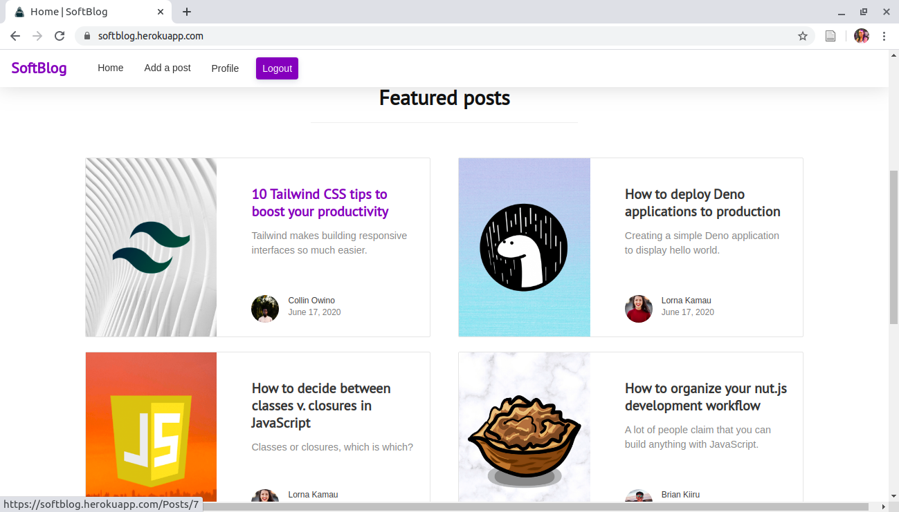

# SoftBlog
#### A software engineering blog , 17/06/2020.
#### By Lorna Kamau

## Description
SoftBlog is a software development blog that allows software developers around the world to write posts on anything software development.

## Live link
Visit the application on https://softblog.herokuapp.com/ .

## Development
To make advancements/modifications, follow these steps:

- Fork the repository
- Create a new branch (`git checkout -b improve-feature`)
- Make the appropriate changes in the files
- Add changes made
- Commit your changes (`git commit -am 'Improve feature'`)
- Push to the branch (`git push origin improve-feature`)
- Create a Pull Request 

## Technologies Used
Technologies used to develop this application:

1. Python v3.6
2. Flask 1.1.2
3. Flask-Bootstrap
4. HTML 
5. CSS

## Support and contact details

Should you be unable to access the website, have any recommendations and/or questions, feel free to email me:[kamaulorna@gmail.com](mailto:kamaulorna@gmail.com)

## [License](https://github.com/lornakamau/softblog/blob/master/LICENSE.md)

Copyright (c) 2020 [Lorna Kamau](https://github.com/lornakamau)  